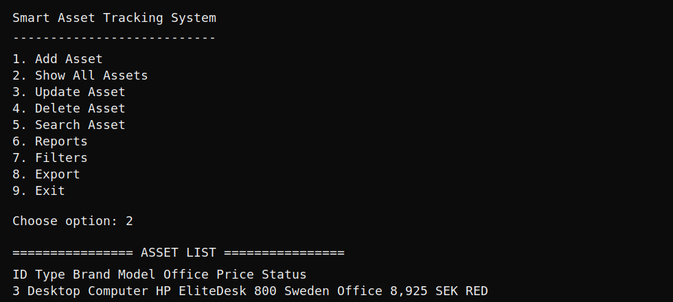

# Smart Asset Tracking System

A C# .NET Console Application for tracking company assets such as laptops, desktop computers, mobile phones, tablets and office equipment.

The project uses Entity Framework Core, SQL Server LocalDB, migrations, LINQ, OOP inheritance, CRUD operations, reports, filtering and export features.

## Console Preview



```text
Smart Asset Tracking System
---------------------------
1. Add Asset
2. Show All Assets
3. Update Asset
4. Delete Asset
5. Search Asset
6. Reports
7. Filters
8. Export
9. Exit

Choose option: 2

================ ASSET LIST ================

ID   Type             Brand          Model                Office           Price            Status
--------------------------------------------------------------------------------------------------------
3    Desktop Computer HP             EliteDesk 800        Sweden Office    8,925 SEK        RED
1    Laptop           Dell           Latitude 5440        Germany Office   1,104 EUR        NORMAL
4    Tablet           Samsung        Galaxy Tab S9        Turkey Office    24,000 TRY       NORMAL
2    Mobile Phone     Apple          iPhone 15            USA Office       999 USD          NORMAL

====================================================
```

## Features

- Add, show, update, delete and search assets
- Office equipment can be registered as a general asset
- Inheritance with `Asset`, `ComputerAsset` and `MobileAsset`
- Separate EF Core tables for asset categories using TPT inheritance:
  - `Assets`
  - `ComputerAssets`
  - `MobileAssets`
  - `Offices`
- SQL Server LocalDB database
- EF Core migrations
- LINQ sorting, searching, filtering and reporting
- Asset lifecycle status: `EXPIRED`, `RED`, `YELLOW`, `NORMAL`
- Office and currency support for Sweden, USA, Germany and Turkey
- Fixed USD conversion rates
- Reports for office value, office count, near-expiration assets and most expensive assets
- Export reports to TXT, CSV and JSON
- Async EF Core database operations in the main services
- Pagination support for longer asset lists

## Asset Status Logic

The assignment text has inconsistent wording for `RED` and `YELLOW`. This project uses the more common business interpretation where `RED` is the most urgent warning:

```text
EXPIRED = asset is past its 3-year lifetime
RED     = less than 3 months remaining
YELLOW  = less than 6 months remaining
NORMAL  = more than 6 months remaining
```

## Project Structure

```text
AssetTrackingSystem/
|-- Data/
|   `-- AppDbContext.cs
|-- Helpers/
|   |-- AssetStatusHelper.cs
|   |-- ConsoleHelper.cs
|   `-- CurrencyHelper.cs
|-- Models/
|   |-- Asset.cs
|   |-- ComputerAsset.cs
|   |-- MobileAsset.cs
|   `-- Office.cs
|-- Reports/
|   `-- ExportService.cs
|-- Services/
|   |-- AssetService.cs
|   |-- OfficeService.cs
|   `-- ReportService.cs
|-- Migrations/
|-- Program.cs
`-- AssetTrackingSystem.csproj
```

## Technologies

- C#
- .NET 10 Console App
- Entity Framework Core
- SQL Server LocalDB
- LINQ
- OOP and inheritance
- EF Core migrations

## Database

The app uses SQL Server LocalDB with this example local development connection string:

```text
Server=(localdb)\mssqllocaldb;Database=AssetTrackingDb;Trusted_Connection=True;TrustServerCertificate=True
```

LocalDB is good for school projects and local development on Windows. This connection string does not contain a username, password or cloud secret.

## How To Run Locally

1. Clone the repository:

```bash
git clone https://github.com/osmanosmani/AssetTrackingSystem.git
cd AssetTrackingSystem
```

2. Restore packages:

```bash
dotnet restore
```

3. Apply migrations and create the database:

```bash
dotnet ef database update
```

4. Run the application:

```bash
dotnet run
```

## Useful EF Core Commands

Create a new migration after changing model classes:

```bash
dotnet ef migrations add MigrationName
```

Apply migrations to the database:

```bash
dotnet ef database update
```

List migrations:

```bash
dotnet ef migrations list
```

If a migration is empty, EF Core usually did not detect a model change.

## GitHub Deployment

This is a console application, so the best first "deployment" is publishing the source code to GitHub.

Recommended steps:

```bash
git init
git add .
git commit -m "Add smart asset tracking system"
git branch -M main
git remote add origin https://github.com/osmanosmani/AssetTrackingSystem.git
git push -u origin main
```

Do not commit generated folders such as `bin/`, `obj/`, `.vs/`, or generated report files.

## Docker Note

Docker is possible, but SQL Server LocalDB does not run inside a normal Linux Docker container.

For Docker, use:

- one container for the .NET console app
- one container for SQL Server
- a normal SQL Server connection string instead of LocalDB

Example SQL Server Docker connection string:

```text
Server=sqlserver,1433;Database=AssetTrackingDb;User Id=sa;Password=YourStrongPassword123!;TrustServerCertificate=True
```

For this school project, GitHub + LocalDB is the simplest and most presentation-friendly option.

## Known Limitations

- Exchange rates are fixed manually for educational purposes.
- SQL Server LocalDB is intended for local Windows development.
- Login, roles and employee management are not included in the current version.
- The console UI is designed for a school project demo, not for production use.

## School Project Checklist

- [x] C# Console Application
- [x] Entity Framework Core
- [x] SQL Server LocalDB
- [x] Migrations
- [x] LINQ
- [x] OOP
- [x] Inheritance
- [x] CRUD operations
- [x] Validation
- [x] Exception handling
- [x] Reports
- [x] Search and filtering
- [x] TXT, CSV and JSON export
- [x] Pagination for larger lists
- [x] Async EF Core operations
- [x] Clean folder structure

## Presentation Notes

This project demonstrates a practical console-based business application. During a presentation, a good flow is:

1. Show the menu and explain the asset tracking problem.
2. Show the model structure: `Asset`, `ComputerAsset`, `MobileAsset`, and `Office`.
3. Explain that EF Core maps inheritance with separate category tables.
4. Demonstrate `Show All Assets`, `Search`, `Reports`, and `Export`.
5. Mention validation, status calculation, currency conversion, and migrations.

## Author

School mini project: Smart Asset Tracking System
